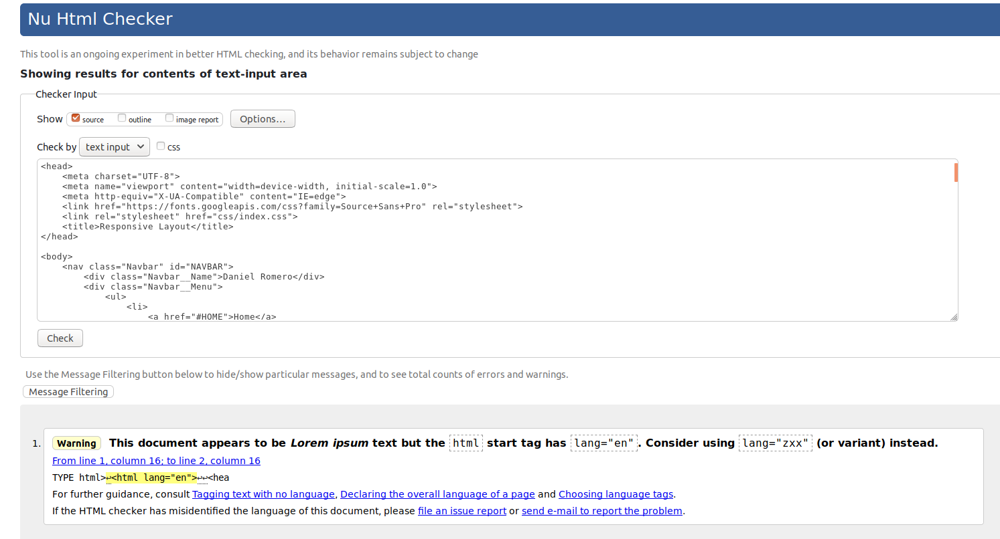

# Second project for the 20h talent ikigai bootcamp

## Goal

The goal for this project is make a responsive layout starting with **"mobile first"** and giving the behaviour to adapt the design for both, tablet and desktop.

### Tools and concepts using in this project:

- Visual Studio Code
- BEM Methodology to write CSS rules
- CSS Media Queries
- CSS Flexbox
- Semantic HTML5
- W3C validated

### W3C validation

